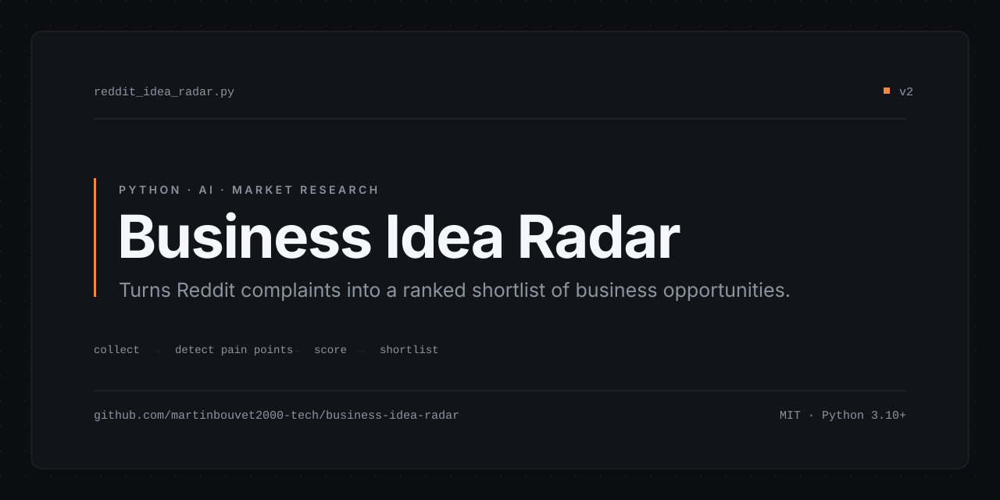
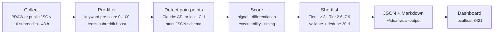

# Business Idea Radar

Turns Reddit complaints into a ranked shortlist of business opportunities.

**[Project page](https://martinbouvet2000-tech.github.io/business-idea-radar/)** · **[Source](https://github.com/martinbouvet2000-tech/business-idea-radar)**

## The problem

Founder forums are full of people describing, in detail, a problem they already pay to work around — the price they hate, the tool that almost works, the manual step they repeat every week. That is the raw material of a product. But it is buried in thousands of threads a day, it is written as venting rather than as a spec, and by the time you scroll far enough to notice a pattern you have lost the afternoon.

Reading it by hand does not scale. Keyword alerts do not either: "expensive" and "I wish there was" match noise as readily as signal, and neither tells you whether anyone else in the thread agreed.

## What it does

- **Collects threads from Reddit in two modes.** With Reddit API credentials it uses PRAW; without them it falls back to Reddit's public JSON endpoints, so the scanner runs with zero credentials. If PRAW authentication fails at runtime it falls back to the public endpoints automatically.
- **Filters and pre-ranks before spending a token.** Defaults: 16 subreddits (startup, dev, creator and productivity communities), the last 48 hours, a minimum of 15 comments per thread, and the top 20 comments pulled per thread. Threads are ordered by `comments × 0.6 + score × 0.4` so discussion weighs more than upvotes.
- **Pre-scores every thread with a keyword heuristic, before Claude sees it.** A 0–100 score built from pain phrasing in the title and body, self-promo/hiring/meme anti-signals, the comment-to-upvote ratio, willingness-to-pay phrasing in the comments, and an upvote baseline. Threads under 20 are dropped so they never consume tokens.
- **Boosts pain that shows up in more than one subreddit.** Threads sharing five or more meaningful title terms across different subreddits are linked; one match multiplies a thread's rank by 1.5×, three or more by 2×, and a cross-signal thread survives the pre-filter even if its own score is low.
- **Alerts on Tier 1 findings.** `notifier.py` appends to `~/idea-radar-output/alerts.log`, plays a system sound, shows a Windows toast (with a `MessageBox` fallback), and POSTs a JSON summary to `WEBHOOK_URL` if one is set. Every channel fails silently; the scan never crashes because a notification did.
- **Extracts structured opportunities with Claude.** Each thread batch is sent to a market-analysis prompt that returns a strict JSON schema: the problem and its type (`COST`, `TIME`, `FRICTION`, `MISSING`), direct quotes as pain evidence, the existing solutions named in the thread and why commenters say they fail, a differentiation angle, the target profile, the users worth contacting, a monetization model, and next actions.
- **Runs the analysis two ways.** Either against the Anthropic API, or with `--local`, which shells out to the Claude Code CLI and consumes no API credits.
- **Scores and tiers each idea.** Four sub-scores — market signal, differentiation, solo executability, timing — produce a composite out of 10. Composite ≥ 8 is Tier 1 (investigate now), 6–7.9 is Tier 2 (needs more signal), below 6 is dropped silently.
- **Rejects malformed model output.** Every idea is validated (tier present and in range, composite a number in 0–10, problem title non-empty) before it is written; anything that fails is filtered and counted.
- **Deduplicates against the last 30 days** of previous runs, so a recurring complaint does not resurface every morning.
- **Writes JSON and a Markdown report** to `~/idea-radar-output/`: `TIER1_<date>.json`, `TIER2_<date>.json`, `ALL_<date>.json` and `RADAR_<date>.md`. Output paths are resolved and checked against the output directory to block path traversal.
- **Ships a local dashboard** — a single-file threaded `http.server` app bound to `127.0.0.1:8421` that lists and renders past runs. No build step, no framework. `HOST`, `PORT` and `OUTPUT_DIR` are read from the environment so the same file runs in a container.
- **Containerises in one step.** A `Dockerfile`, a `Procfile` and a `railway.json` are included for running the dashboard as a long-lived service.

## How it works



1. **Collect** — threads newer than `--hours`, with at least `--min-comments` comments, from each subreddit's `hot` and `new` listings; the top comments of each surviving thread are fetched and attached.
2. **Pre-filter** — each thread gets a 0–100 keyword score, cross-subreddit duplicates of the same pain are linked and boosted, threads below 20 are dropped, and the rest are sorted by `pre_score × signal_strength`.
3. **Detect pain points** — batches of formatted threads go to Claude with the radar prompt. It is told to return only a JSON array, to treat thread text as untrusted user content, and to return `[]` when nothing is viable.
4. **Score** — the model assigns the four sub-scores and a composite; malformed or out-of-range results are discarded rather than repaired.
5. **Shortlist** — surviving ideas are split into Tier 1 / Tier 2, sorted by composite, deduplicated against the previous 30 days, and written out.

## Stack

| Layer | Choice |
|---|---|
| Language | Python 3.10+ (uses `X \| None` type syntax) |
| Reddit collection | `urllib` against Reddit's public JSON endpoints; PRAW if installed and credentials are set |
| Analysis | Anthropic SDK (`claude-sonnet-4-6` by default) or the Claude Code CLI via `--local` |
| Config | `python-dotenv` |
| Dashboard | Python standard library `http.server`, single-file HTML |
| Tests | `unittest`, run under `pytest` — stdlib only, no network, no credentials |
| CI | GitHub Actions, Ubuntu + Python 3.12 |
| Deployment | `Dockerfile`, `Procfile`, `railway.json` |
| Runners | `run_radar.ps1` (full free-mode scan), `open-radar.bat` (dashboard) |

`praw` and `anthropic` are both optional imports. Only `python-dotenv` is installed by default; uncomment the others in `requirements.txt` if you want authenticated collection or API-based analysis.

## Run it yourself

```bash
git clone https://github.com/martinbouvet2000-tech/business-idea-radar.git
cd business-idea-radar
pip install -r requirements.txt

cp .env.example .env    # optional — see below
```

Everything in `.env` is optional. With no Reddit credentials the scanner uses the public JSON endpoints; with no `ANTHROPIC_API_KEY` it auto-switches to `--local` if the Claude Code CLI is on your `PATH`.

| Variable | Required | Purpose |
|---|---|---|
| `REDDIT_CLIENT_ID` | No | Enables PRAW collection (faster, higher rate limits) |
| `REDDIT_CLIENT_SECRET` | No | Same |
| `REDDIT_USER_AGENT` | No | Defaults to `RedditIdeaRadar/2.0` |
| `ANTHROPIC_API_KEY` | No | Required unless you use `--local`, `--dry-run` or `--scrape-only` |
| `WEBHOOK_URL` | No | If set, each Tier 1 idea is POSTed there as JSON |
| `HOST` | No | Dashboard bind address, defaults to `127.0.0.1` |
| `PORT` | No | Dashboard port, defaults to `8421` |
| `OUTPUT_DIR` | No | Where reports are read from, defaults to `~/idea-radar-output` |

Scan and analyse:

```bash
# See what would be collected, analyse nothing
python reddit_idea_radar.py --dry-run

# Full run, analysis through the Anthropic API
python reddit_idea_radar.py

# Full run, analysis through the Claude Code CLI (no API credits)
python reddit_idea_radar.py --local

# Narrow the scan
python reddit_idea_radar.py --hours 24 --min-comments 30 --subreddits SaaS IndieHackers
```

Two-step free run (collect now, analyse later) — this is what `run_radar.ps1` automates:

```bash
python reddit_idea_radar.py --scrape-only --hours 48
python reddit_idea_radar.py --from-file ~/idea-radar-output/THREADS_2026-01-31.json --local
```

Browse past runs:

```bash
python dashboard.py        # http://localhost:8421
python dashboard.py 9000   # a different port
```

On Windows, `run_radar.ps1` runs the full free-mode scan and `open-radar.bat` starts the dashboard and opens a browser.

All flags: `--hours`, `--min-comments`, `--subreddits`, `--model`, `--dry-run`, `--scrape-only`, `--local`, `--from-file`, `--output`.

## Tests

```bash
pip install pytest
python -m pytest test_radar.py -v   # or: python test_radar.py
```

60 tests covering the pure logic: thread pre-scoring, cross-subreddit signal detection, idea validation, tier classification, the JSON-extraction pattern used on model output, and the dedup filter. They use only the standard library — no network, no API key, no Reddit credentials — and run in CI on every push.

The parts that need the network or a model (scraping, Claude analysis, report rendering) are not covered.

## Run the dashboard in a container

```bash
docker build -t idea-radar .
docker run -p 8421:8421 -v "$HOME/idea-radar-output:/app/data" idea-radar
```

The image runs `dashboard.py` with `HOST=0.0.0.0`, `PORT=8421` and `OUTPUT_DIR=/app/data`. `Procfile` and `railway.json` are there for platforms that expect them. The dashboard still has no authentication — put it behind something that does before exposing it.

## Status & limits

This is a working prototype and a personal tool, not a product. Read it that way:

- **Scores are model judgements, not measured market data.** "Market signal 7/10" means Claude read a thread and said 7. There is no traffic data, no revenue data and no survey behind it. Treat the output as a reading queue, not a verdict.
- **Output quality tracks the model and the prompt.** A different model, or a batch of threads that happens to be noisy, changes the results. Runs are not reproducible.
- **The analysis prompt is written in French**, so the generated reports come out in French even though the code and this README are in English.
- **Tests cover the pure logic only.** Scraping, the Claude calls and report generation have no automated coverage; a green CI run does not mean a scan works end to end.
- **The pre-filter is keyword matching, not understanding.** It throws away threads whose phrasing it does not recognise, and its thresholds were tuned by hand rather than measured.
- **The public JSON mode is rate-limited** and Reddit can throttle or block it; PRAW credentials make runs materially more reliable.
- **The dashboard has no authentication.** It defaults to `127.0.0.1` deliberately and reads files from your home directory. The container sets `HOST=0.0.0.0` because it has to — do not expose that port publicly without putting auth in front of it.
- **Desktop notifications are Windows-only.** The toast and sound paths no-op elsewhere; the log file and the webhook work everywhere.
- **`--from-file` only accepts `.json` paths under your home directory**, by design.
- **Not packaged.** No `pyproject.toml`, no entry point, no published artifact — clone and run.

## License

[MIT](LICENSE) © Martin Bouvet
